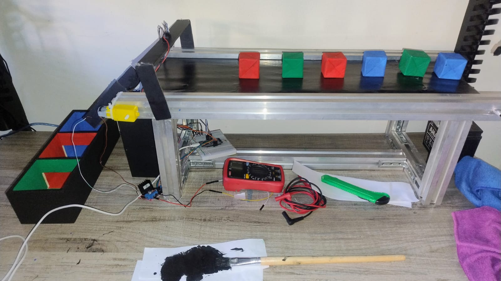

# 🏭 AI-Powered Smart Conveyor Belt | Color Sorting System
**Sistema de Clasificación Automatizada con Visión Artificial (KNN) y Control de Hardware mediante ESP32**

Este proyecto es una solución integral de ingeniería que combina **Inteligencia Artificial**, **Sistemas Embebidos** y **Automatización**. El sistema detecta objetos por color en una banda transportadora usando una cámara y los clasifica físicamente mediante un actuador controlado por una ESP32.

---

## 📺 Demostración en Video
)
*Haz clic en la imagen para ver el sistema en acción: Detección, comunicación serial y clasificación física.*

---

## 📸 Montaje del Hardware (Physical Setup)

*Vista del prototipo: Integración de cámara USB, driver L298N, servomotor, pantalla TFT y la unidad de control ESP32.*

---

## 🚀 Arquitectura del Sistema

El proyecto opera bajo una arquitectura de procesamiento distribuido:

### 🧠 Capa de Inteligencia Artificial (PC)
* **Modelo:** Clasificador K-Nearest Neighbors (KNN) entrenado con histogramas de color en espacio **HSV** (16 bins) para robustez ante cambios de luz.
* **Visión:** Procesamiento en tiempo real con **OpenCV**. Cuando se detecta un color con una confianza establecida, se envía una señal vía Serial (UART) a 115200 baudios.

### 🎮 Capa de Control Embebido (ESP32)
* **Firmware:** Programado en **MicroPython**.
* **Clasificación:** El sistema recibe el color y posiciona un servomotor en ángulos específicos para desviar el objeto:
  * **Rojo:** 0° | **Verde:** 45° | **Azul:** 90° | **Amarillo:** 135°.
* **HMI (Interfaz):** Visualización en tiempo real en pantalla **TFT ILI9341**, mostrando el color detectado y el estado de la banda.

---

## 📂 Estructura del Repositorio
* **`IA_Model/`**: Scripts para entrenamiento y validación del modelo KNN.
* **`App_PC/`**: Aplicación de visión artificial y puente de comunicación serial.
* **`ESP32_Firmware/`**: Código MicroPython para el control de motores, sensores y pantalla.
* **`modelo_knn_colores_mejor.pkl`**: Modelo de IA entrenado listo para producción.

---

## 🛠️ Stack Tecnológico
* **Lenguajes:** Python 3.12, MicroPython.
* **Librerías:** OpenCV, Scikit-learn, NumPy, Joblib, PySerial.
* **Hardware:** ESP32, Driver L298N, Servomotor MG995, Pantalla TFT SPI.

---

## 👨‍💻 Autor
**Kevin David Mosquera Trujillo**
* Ingeniería Mecatrónica.
* Especialista en Integración de IA y Sistemas de Control.
